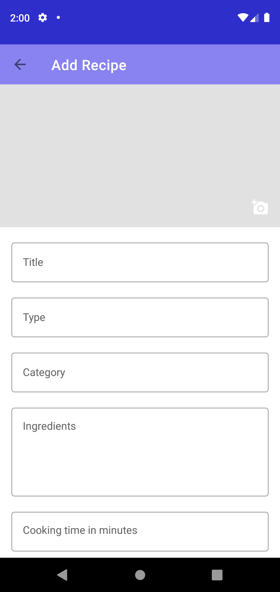

# FoodieRecipe

FoodieRecipe helps users to record recipes with details. Users can create a recipe with picture.

## Screenshot

## Contributing
Pull requests are welcome. For major changes, please open an issue first to discuss what you would like to change.

Please make sure to update tests as appropriate.

## License
[MIT](https://choosealicense.com/licenses/mit/)
